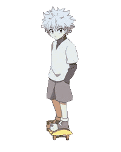
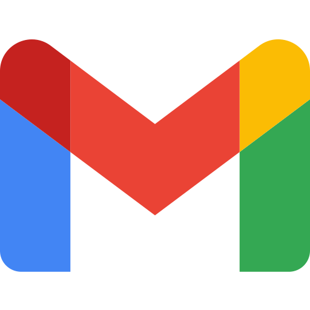

<!-- # Hello, there!  
--->

  

# Tech Stack and Tools that I use 

  Currently, I'm focusing on front-end development, getting better at JavaScript, HTML and CSS; 
  Alongside my formal education, I'm dedicated to developing my Python and TypeScript skills as well through self-learning. C++ is the language I used to make two projects at university;

  
  
  
  
  
  
  
  
  

# GitHub Stats 

   

 

<!--
# Personal Projects 
<table>
  <tr>
    <td width="35%" valign="top">
      
    </td>
    <td width="65%" valign="top">
      <ul>
        <li>;</li>
        <li>;</li>
        <li>;</li>
      </ul>
    </td>
  </tr>
</table>
-->

# Discover a bit more about me...  
<table>
  <tr>
    <td valign="center" width="65%">
      <ul>
        <li>I'm from Brazil, currently studying at the University of Fortaleza - Unifor;</li>
        <li>When I'm not hitting the books, you can usually find me enjoying games like Hollow Knight and Dead Cells;</li>
        <li>I'm also a big fan of animation - Ghibli, Big Hero 5, AoT, HTTYD, Monster, HxH, Death Note and One Piece are my favorites of all time;</li>
        <li>I absolutely love all the process envolving on learning, and sharing knowlege;</li>
        <li>My favorite flavor profile is coffee. I enjoy all its variations, including cappuccinos, lattes, espressos, and black coffee. Additionally, I have a particular fondness for coffee-based desserts;</li>
        <li>Outside of gaming, I'm always jamming to rock music, even when I'm coding;</li>
      </ul>
    </td>
    <td valign="center" width="50%" align="center">
      
    </td>
  </tr>
</table>

<!--

   

-->

 
   
  <i>Thanks for passing by!</i>  
  <i>You can reach me on</i>  
  <a href="www.linkedin.com/in/anaclaramtn">
  <code></code>
  </a>
  <a href="mailto:anaclaramtn@gmail.com">
  <code></code>
  </a>
  <a href="mailto:anaclaramtn@edu.unifor.br">
  <code></code>
  </a>
  <a href="https://instagram.com/mtnanaclara_">
  <code></code>
  </a>

<!--
  <a href="https://discord.com/users/323609489783914497">
  <code></code>
  </a>
-->
